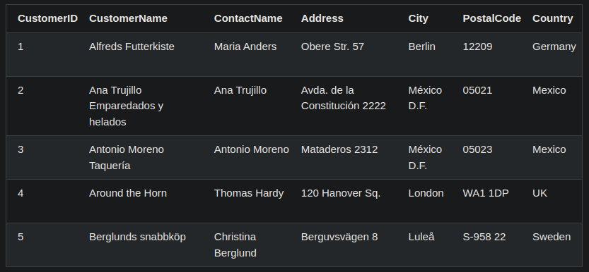

https://www.w3schools.com/sql/sql_syntax.asp

# SQL Sintaxe

- ### Declarações SQL

  - A maioria das ações que você precisa executar em um banco de dados são feitas com instruções SQL.

  - Instruções SQL consistem em palavra-chave que são fáceis de entender.

  - A seguinte instrução SQL retorna todos os registros de uma tabela chamada "Clientes"

    - ```sql
        SELECT * FROM Clientes;
      ```

- ### Tabelas em um Banco de Dados:

  - Um banco de dados geralmente contém uma ou mais tabelas. Cada tabela é identificada por um nome(por exemplo: 'Clientes' ou 'Ordens'), e conter registros(linhas) com dados.

  - 

    - A tabela ilustrada a cima contém cinco registros(um para cada cliente) e sete colunas(CustomerID, CustomerName, ContactName, Address, City, PostalCode, Country).

- # NOTA:

  - Palavras-chave SQL !! NÃO !! são `case-sensitive`(a != A).

  - Neste tutorial vamos escrever todas as palavras-chave SQL em maiúsculas.

- ### Ponto & Vírgula(`;`) depois da declaração SQL?

  - Alguns sistemas de banco de dados exigem um ponto e vírgula no final de cada declaração SQL.

  - Ponto e vírgula é a maneira padrão de separar cada instrução SQL em sistemas/aplicações de banco de dados que permitem que mais de uma instrução SQL seja executada na mesma chamada para o servidor.

  - Neste tutorial vamos usar ponto e vírgula.

- ### Alguns dos comandos SQL mais importantes:

```sql
    SELECT - Retorna uma lista dos registros de um banco de dados.

    UPDATE - Atualiza registros em um banco de dados.

    DELETE - Deleta um registro em banco de dados.

    INSERT INTO - Insere novos registros em um banco de dados.

    CREATE DATABASE - Cria um banco de dados.

    ALTER DATABASE - Modifica um banco de dados

    CREATE TABLE - Cria uma tabela em um banco de dados.

    ALTER TABLE - Modifica uma tabela em um banco de dados.

    DROP TABLE - Deleta uma tabela em um banco de dados

    CREATE INDEX - Cria um índice(chave de pesquisa).

    DROP INDEX - Deleta um ídice.
```
